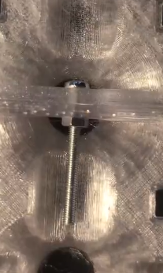
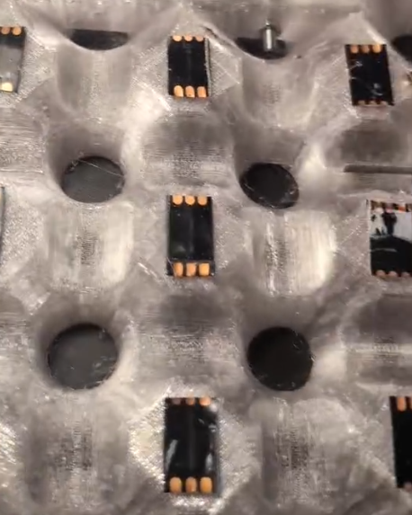
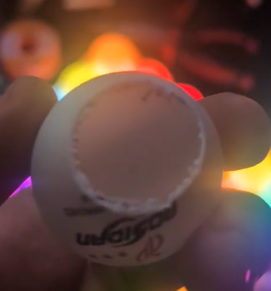
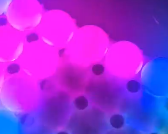
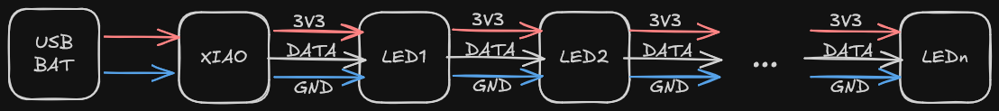

# Instructions

## Parts

- Xiao ESP32-C3 (main processing unit)
- 25 LEDs per tile (a cut-up WS2812B strip works well)
- 25 ping-pong balls per tile
- ~150 wires to connect all LEDs
- 4 M3 threaded inserts per tile
- 4 M3 bolts per tile
- 2 M3 bolts per tile-to-tile connection
- 2 M3 nuts per tile-to-tile connection

## Assembly

1. Insert all threaded inserts into the holes on the back side of the 3D print.

    

2. If you printed multiple panels, connect them using M3 nuts and bolts.

    

3. Hot-glue all LEDs into their holes on the back of the print. Keep LED direction consistent and follow a serpentine pattern.

    

4. Solder all LEDs together.

    

5. Glue the Xiao ESP32 in place.

    

6. Solder the first LED in the chain to the Xiao.

7. Cut off the bottom half of each ping-pong ball, and sand off any printed text.

    

8. Glue in the ping-pong balls.

    

9. Screw on the back panels.

    

## Diagram

